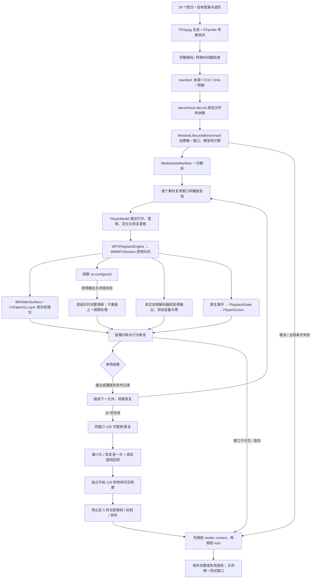

# 真实调用链

```mermaid
flowchart TD
    R[30 个配方 / 自有图案与波形] --> G[FFmpeg 生成 + FFprobe 参数核对]
    G --> D[完整解码 / 特殊时间戳检查]
    D --> M[manifest: 来源 / CC0 / SHA / 预期]
    M --> C[benchmark-dev.sh 核验文件和依赖]
    C --> W[WindowLifecycleBenchmark 创建唯一窗口、模型和引擎]
    W --> S[MediaSuiteManifest 一次解析]
    S --> L[逐个素材复用窗口和播放会话]
    L --> P[PlayerModel 提交打开、暂停、定位与恢复意图]
    P --> E[MPVPlaybackEngine → BMMPVSession 控制队列]
    E --> V[BMVideoSurface / CAOpenGLLayer 真实帧提交]
    E --> VO[观察 vo-configured]
    VO -->|视频输出关闭或未知| CL[渲染队列完整清屏；不重画上一视频纹理]
    CL --> Q
    E --> A[真实音频解码器和音频输出，测试音量为零]
    E --> B[原生事件 → PlaybackState → PlayerScreen]
    V --> Q[按需诊断与行为断言]
    A --> Q
    B --> Q
    Q --> F{单项结果}
    F -->|通过或播放失败均记录| N[继续下一文件，观察恢复]
    N --> L
    N -->|30 项完成| T[同窗口 100 次暂停/恢复]
    T --> O[最小化 / 恢复各一次 + 真实遮挡回调]
    O --> U[独立开始 120 秒持续可见观察]
    U --> X[停止后 5 秒无新增帧 / 绘制 / 采样]
    X --> Z[先释放 render context，再销毁 mpv]
    Z --> J[保存完整或失败报告；关闭唯一测试窗口]
    W -->|取消 / 全局条件失败| Z
    Q -->|窗口不可见 / 取消| Z
```

存在素材失败时，后面的独立检查可以继续执行，但最终整体仍失败。主动最小化、素材播放和持续播放的可见性记录互相独立。交付结果以实际报告为准，图中流程不代表每轮必然走完。
